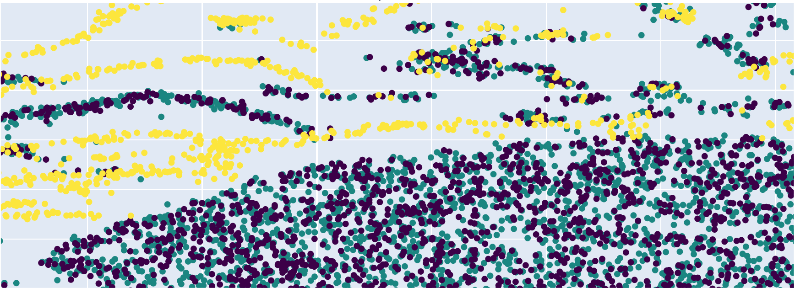
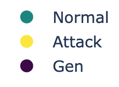
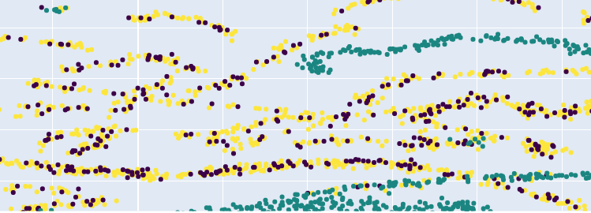

+++
title = "Utilizzo di Soft-Brownian-Offset per la generazione di attacchi ai fini dell’addestramento di rilevatori di intrusioni"
outputs = ["Reveal"]
[logo]
src = "logo.svg"
[reveal_hugo]
custom_theme = "reveal-hugo/themes/robot-lung.css"
margin = 0.2
+++

<h1 style="text-transform: inherit; font-size: 2em">Utilizzo di Soft-Brownian-Offset per la generazione di attacchi ai fini dell’addestramento di rilevatori di intrusioni</h1>

---

{} 
### Intrusion Detection Systems (IDS)
{}
{} 
Applicazione che monitora continuamente la rete per identificare attività malevole.
{}
{} 

{}

---

Nell’ultimo decennio si è iniziato ad utilizzare algoritmi di **Machine Learning** per gli IDS.

---

{} 
### Machine Learning
{}
{} 
La branca dell'**Intelligenza Artificiale** che sviluppa modelli per permettere alle macchine di imparare dai dati.
{}

---

{} 
I modelli di Machine Learning sono sensibili ai dati di addestramento.
{}

---

## Dataset di un IDS

{} 

{}

---

## Possibile metodo miglioramento

{} 
**Generare** nuovi dati a partire da quelli già esistenti per migliorare i modelli di Machine Learning
{}

{} 
- Soft-Brownian-Offset
{}

---

{} 
## Scopo della tesi
{}

{} 
Cercare di migliorare un IDS utilizzando Soft-Brownian-Offset
{}

{} 

{}

---

## Soft Brownian Offset

{}
Algoritmo di generazione di dati creato inizialmente per la generazione di eventi anomali.
{}

---

## Dataset utilizzati

{}
- Adfanet
{}

 

{}
- CICIDS
{}

---

### Approcci di Generazione

Generazione a partire dalla tipologia di dati:

{}
- Solo pacchetti normali
{}

 

{}
- Solo pacchetti attacchi
{}

 

{}
- Dataset completo
{}

---

## Grafici

Per una valutazione qualitativa degli approcci di generazione.

---

## Generazione
### A partire da pacchetti normali

---

## Generazione
### A partire da pacchetti di attacchi

---

### Approcci di Addestramento del modello

Addestramento usando:

{}
- Dataset completo + Dati sintetici
{}

 

{}
- Solo pacchetti normali + Dati sintetici
{}

 

{}
- Solo dataset (senza dati generati)
{}

---

### Adfanet

|  | Pacchetti normali + Gen      | Dataset Completo + Gen | Solo Dataset |
| ----------- | ----------- | ----------- | ----------- |
| Gen Normali     | 0.3337       | 0.99839 | 0.93596 |
| Gen Attacchi     | 0.4404       | 0.99865 | 0.93596 |
| Gen Completo     | 0.3452       | 0.99854| 0.93596 |

---



### Adfanet

|  | Pacchetti normali + Gen      | Dataset Completo + Gen | Solo Dataset |
| ----------- | ----------- | ----------- | ----------- |
| Gen Normali     | 0.3337       | 0.99839 | 0.93596 |
| Gen Attacchi     | 0.4404       | **0.99865** | 0.93596 |
| Gen Completo     | 0.3452       | 0.99854| 0.93596 |

---

### CICIDS

|  | Pacchetti normali + Gen      | Dataset Completo + Gen | Solo Dataset |
| ----------- | ----------- | ----------- | ----------- |
| Gen Normali     | -0.1153       | 0.92772 | 0.93596 |
| Gen Attacchi     | -0.1366       | 0.93428 |0.93596 |
| Gen Completo     | -0.1206       | 0.92493| 0.93596 |

---



### CICIDS

|  | Pacchetti normali + Gen      | Dataset Completo + Gen | Solo Dataset |
| ----------- | ----------- | ----------- | ----------- |
| Gen Normali     | -0.1153       | 0.92772 | **0.93596** |
| Gen Attacchi     | -0.1366       | 0.93428 | **0.93596** |
| Gen Completo     | -0.1206       | 0.92493| **0.93596** |

---

### Conclusioni

{}
Soft Brownian Offset è efficace nel caso di dataset **semplici**.
{}
{}
In dataset **complessi** invece l'algoritmo non presenta miglioramenti.
{}

{}
In quest'ultimo caso è necessario rivolgersi ad algoritmi differenti.
{}

---

### Grazie per l'attenzione
